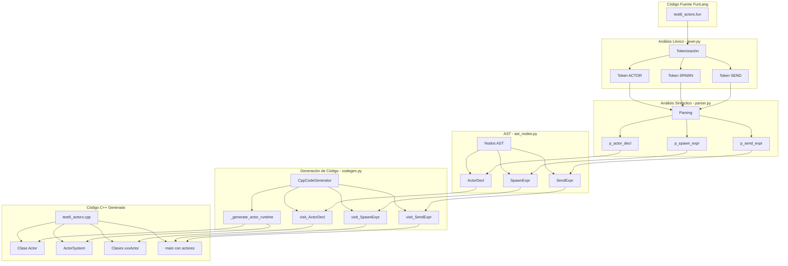
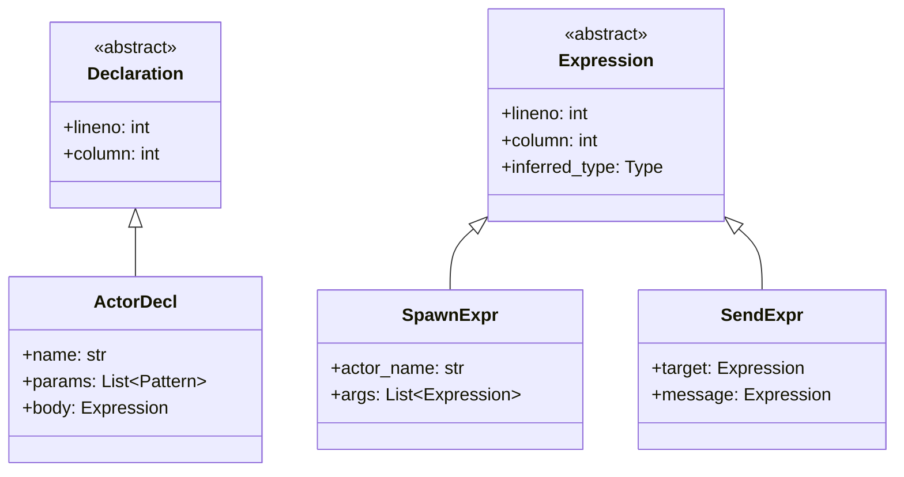
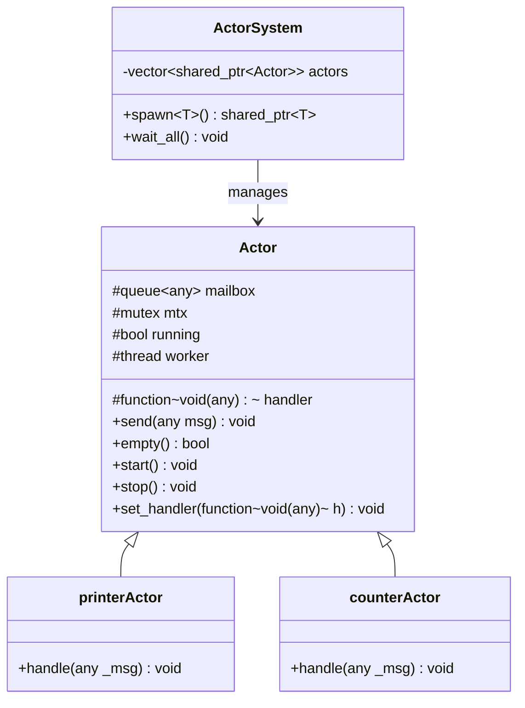
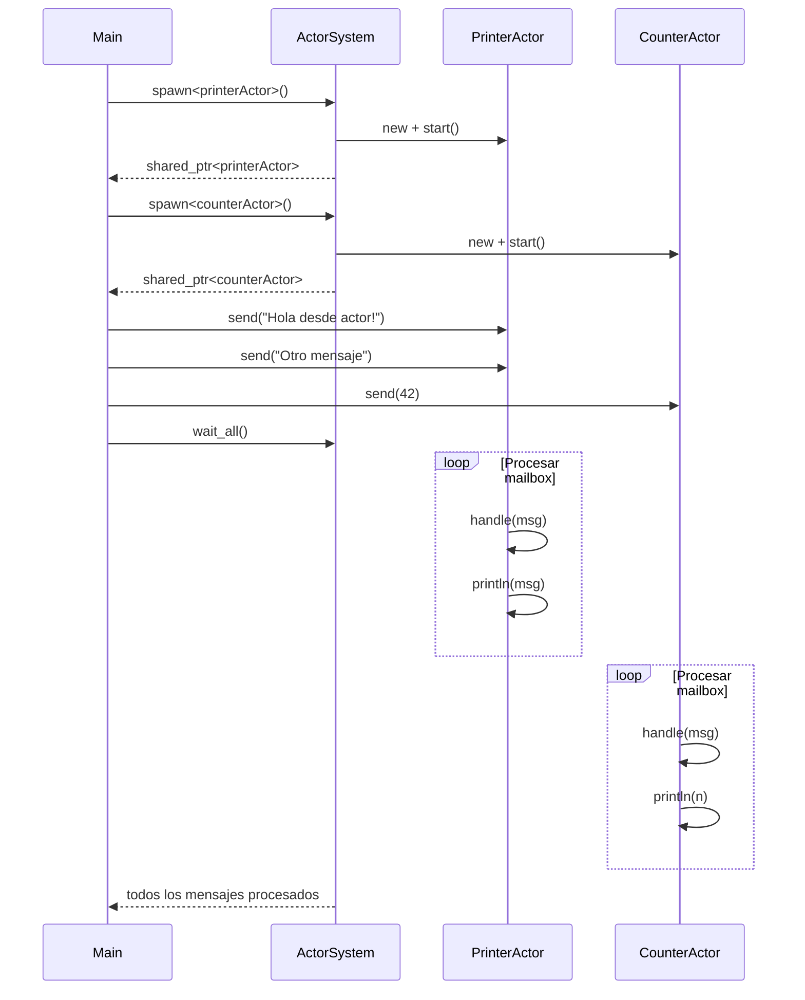

# Diagrama UML - Implementación del Modelo de Actores en FunLang

## Diagrama de Flujo de Compilación

## Diagrama de Clases - Nodos AST

## Diagrama de Clases - Runtime C++ Generado

## Diagrama de Secuencia - Ejecución de Actores

## Sintaxis Añadida

| Construcción | Sintaxis FunLang | Código C++ Generado |
|--------------|------------------|---------------------|
| Declarar actor | `actor nombre param = expr` | `class nombreActor : public Actor { ... }` |
| Crear actor | `spawn nombre` | `actorSystem.spawn<nombreActor>()` |
| Enviar mensaje | `send actor msg` | `actor->send(msg)` |
